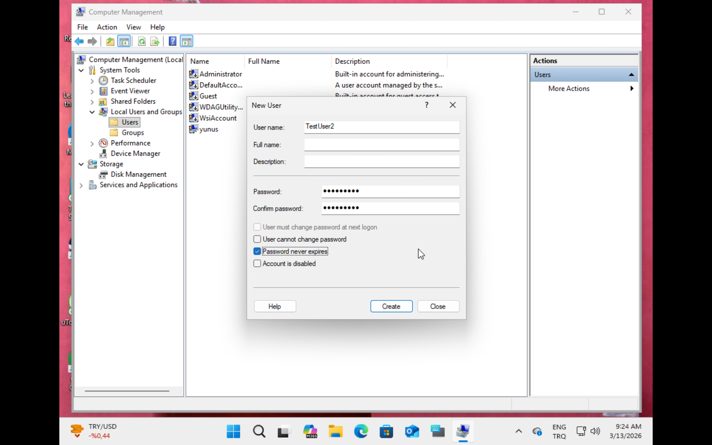
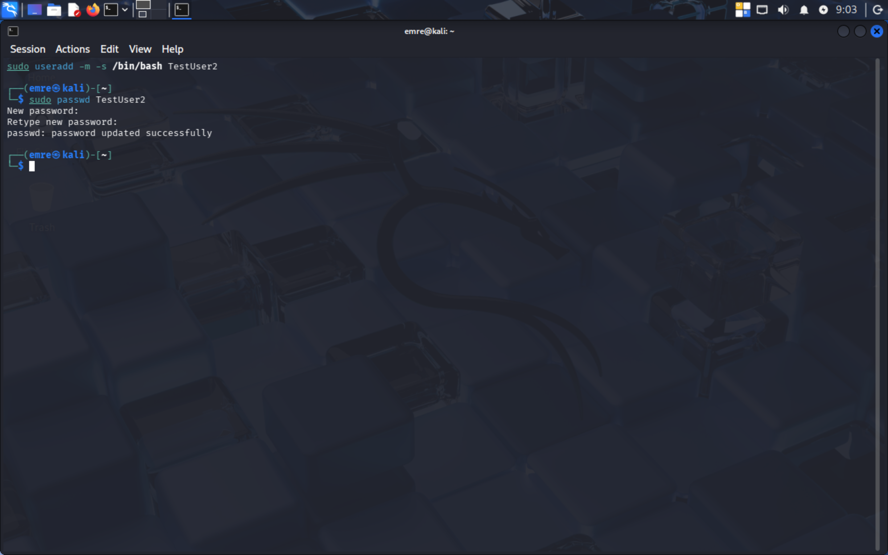
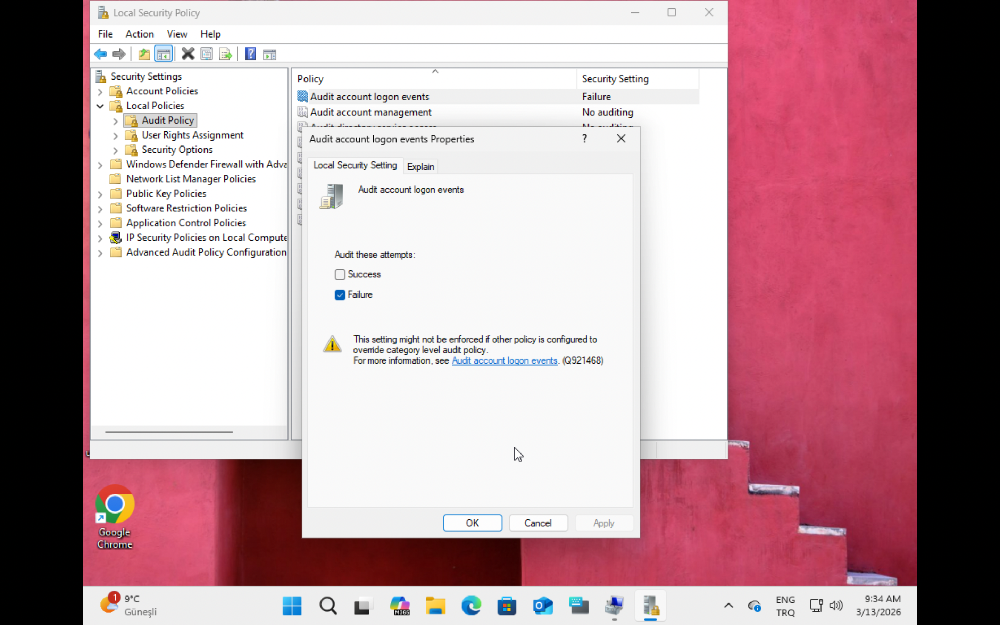
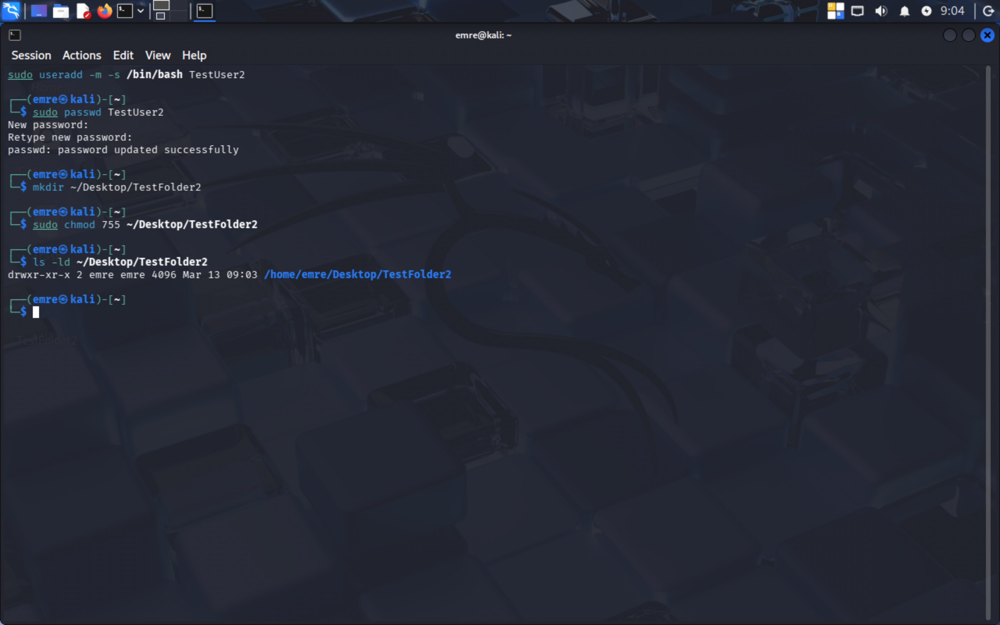
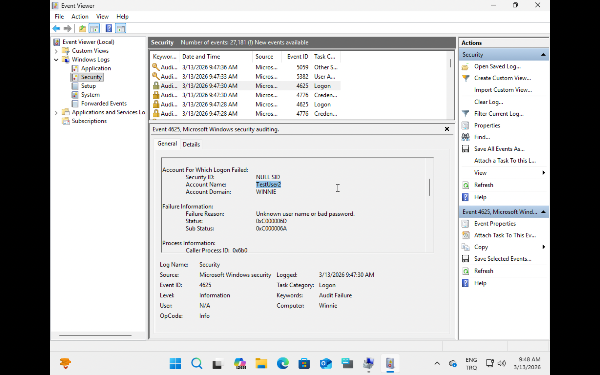
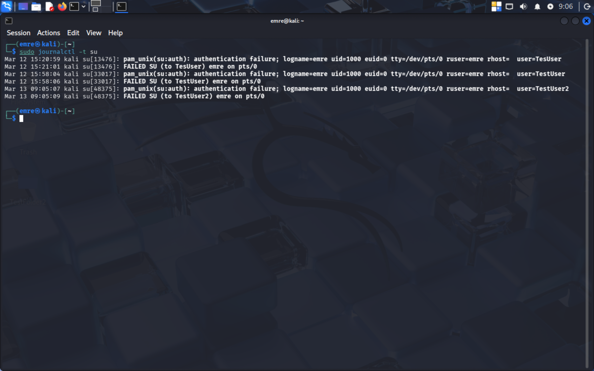
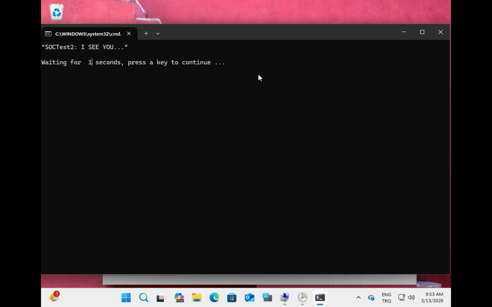
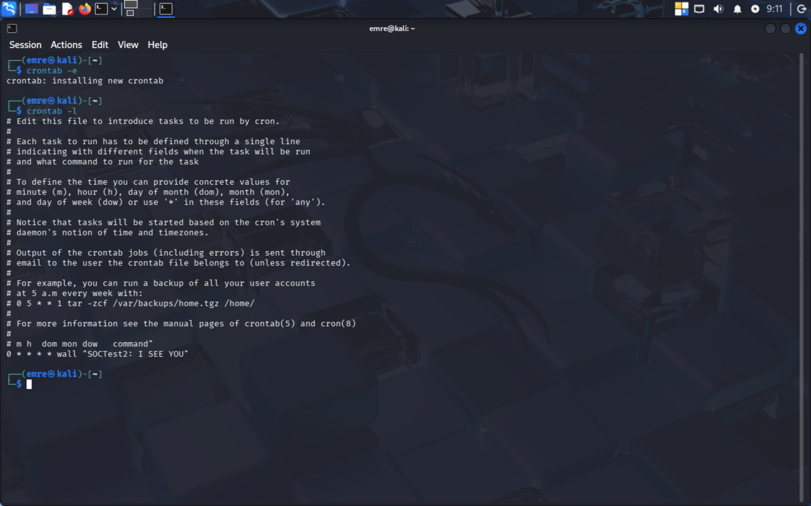

# GoIT Türkiye - Defensive Cyber Security Module
## Endpoint Hardening and Monitoring Lab Practice

[🇹🇷 Türkçe versiyonu için aşağıya kaydırın / Scroll down for Turkish version](#türkçe-versiyon-tr)

**Objective:** To implement fundamental system administration and security hardening protocols across Windows and Linux environments through Identity and Access Management (IAM), Access Control Lists (ACL), Audit Logging & Threat Detection, and Scheduled Task automation.

---

### 1. Identity and Access Management (IAM)
* **Action:** Created a standard user account named TestUser2 with limited privileges.
* **Target:** To mitigate the risk of full system compromise in the event of credential theft by enforcing the Principle of Least Privilege (PoLP), ensuring the user is not included in the local administrators or `sudo` group.

*Figure 1: Windows IAM Configuration*

*Figure 2: Kali Linux IAM Configuration*

---

### 2. Access Control Lists (ACL) and Data Integrity
* **Action:** Created a directory assigned to TestUser2 and restricted the account's permissions to read and execute only, explicitly denying write or modify access.
* **Target:** To ensure data integrity by preventing the encryption or deletion of files within the directory in the event that the restricted account is compromised by malicious software.

*Figure 3: Windows ACL Restriction*

*Figure 4: Kali Linux Chmod Permission Restriction*

---

### 3. Audit Logging & Threat Detection
* **Action:** Enabled audit logging for failed logon events and successfully queried system logs following a simulated incorrect password entry.
* **Target:** To enhance SOC visibility by recording failed authentication attempts in system event viewers, enabling the ingestion of this data into a SIEM to detect potential brute-force attacks.

*Figure 5: Windows Event Viewer - Event ID 4625 (Failed Logon)*

*Figure 6: Kali Linux Journalctl - Failed Authentication Detection*

---

### 4. System Automation (Scheduled Task)
* **Action:** Configured an automated scheduled task (Task Scheduler on Windows, Cron Job on Linux) to execute a specific command prompt script at 1-hour intervals.
* **Target:** To establish a centralized coordination structure aligned with SOC monitoring methodologies, ensuring continuous, independent system tracking and the capability to trigger regular automated scans.

*Figure 7: Windows Task Scheduler Configuration*

*Figure 8: Windows Automated Command Output*

*Figure 9: Kali Linux Cron Job Configuration*

---

# GoIT Türkiye - Savunmacı/Defensive Siber Güvenlik Modülü
## Uç Nokta Sıkılaştırma (Endpoint-Hardening) ve İzleme (Monitoring) Laboratuvar Pratiği

**Amaç:** Kimlik Yönetimi (IAM), Erişim Kontrolü (ACL), Olay Kaydı & Tehdit Tespiti (Audit Logging & Threat Detection) ve Otomasyon (Scheduled Task) adımlarıyla temel sistem yönetimi ve güvenlik sıkılaştırma protokollerini Windows ve Linux ortamlarında uygulamak.

---

### 1. Kimlik ve Erişim Yönetimi (Identity and Access Management - IAM)
* **Eylem:** Sınırlı yetkilere sahip TestUser2 adlı kullanıcı hesabı oluşturulmuştur.
* **Hedef:** “En az ayrıcalık ilkesi” (PoLP) gereği kullanıcının, yöneticiler veya süper kullanıcı (sudo) grubuna dahil olmaması sağlanarak, kimlik hırsızlığı durumunda sistemin tamamen ele geçirilme riskinin azaltılması.

*Görsel 1: Windows IAM Konfigürasyonu*

*Görsel 2: Kali Linux IAM Konfigürasyonu*

---

### 2. Erişim Kontrol Listeleri (ACL) ve Veri Bütünlüğü (Data Integrity)
* **Eylem:** TestUser2 adlı bir klasör oluşturulmuş ve TestUser2’nin bu klasörde yazma veya değiştirme erişimi engellenerek, salt okuma ve çalıştırma yetkisiyle sınırlandırılmıştır.
* **Hedef:** Veri bütünlüğünü güvenceye almak için kısıtlanmış hesabın zararlı yazılımlarca ele geçirilmesi halinde, ilgili dizindeki dosyaların şifrelenmesinin veya silinmesinin engellenmesi.

*Görsel 3: Windows ACL Kısıtlaması*

*Görsel 4: Kali Linux Chmod Yetki Kısıtlaması*

---

### 3. Olay Kaydı ve Tehdit Tespiti (Audit Logging & Threat Detection)
* **Eylem:** Başarısız oturum açma girişimleri için denetim kaydı etkinleştirilmiş ve kasten yanlış şifre girildikten sonra sistem logları başarıyla sorgulanmıştır.
* **Hedef:** GHM/SOC görünürlüğünün (monitoring) artırılması için başarısız girişlerin olay görüntüleyicilerine yazılması ve verilerin SIEM'e aktarılarak kaba kuvvet (brute force) saldırılarının tespit edilmesi.

*Görsel 5: Windows Event Viewer 4625 Numaralı Hatalı Giriş Logu*

*Görsel 6: Kali Linux Journalctl Başarısız Giriş Tespiti*

---

### 4. Sistem Otomasyonu (Scheduled Task)
* **Eylem:** Windows’ta Görev Zamanlayıcı (Task Scheduler), Linux’ta Cron Job üzerinde bir komutu 1 saatlik aralıklarla çalıştıracak bir zamanlanmış görev yapılandırılmıştır.
* **Hedef:** Bağımsız bir sürekli izlemenin sağlanmasıyla düzenli zafiyet taramalarının tetiklenmesi ve GHM/SOC anlayışıyla uyumlu bir merkezi eşgüdüm yapısının kurulması.

*Görsel 7: Windows Task Scheduler Yapılandırması*

*Görsel 8: Windows Otomatik Komut Çıktısı*

*Görsel 9: Kali Linux Cron Job Yapılandırması*
