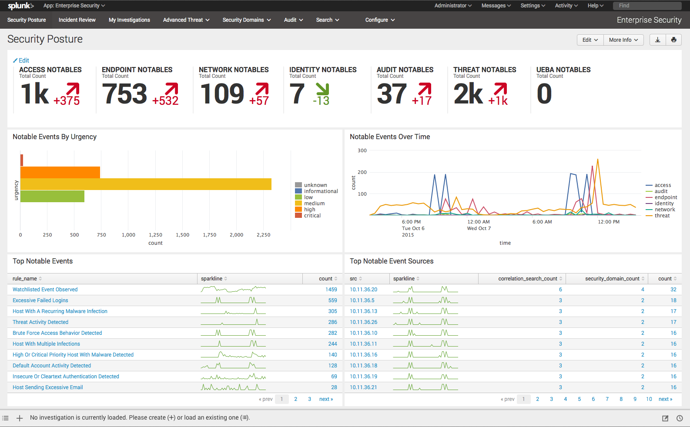
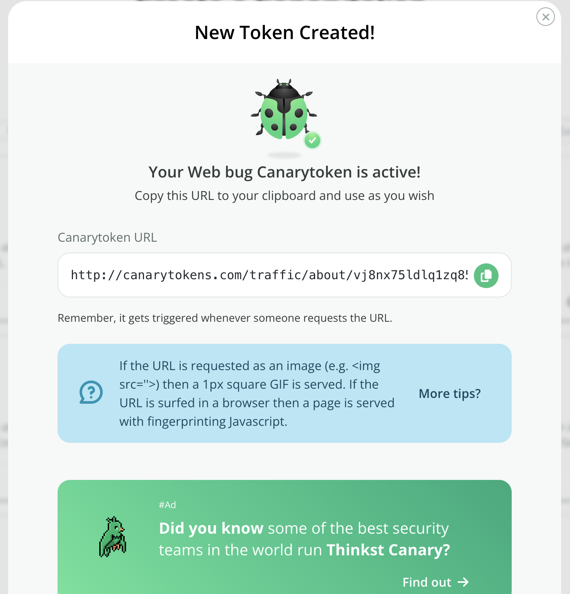
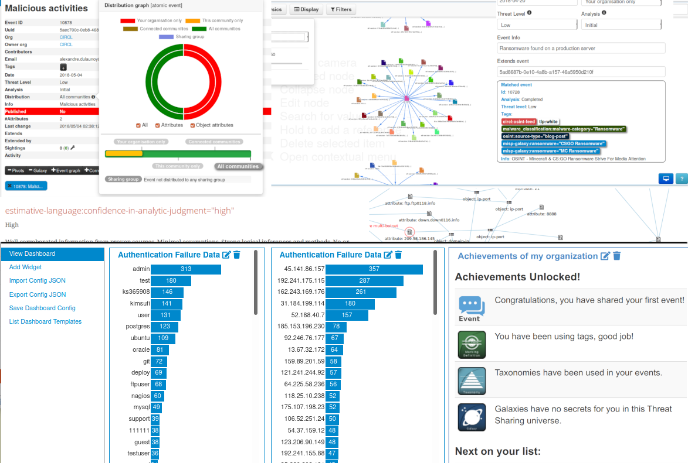

# 🇬🇧 360-Degree Cybersecurity Architecture in Financial Technologies: Zero-Trust Based Total Preventive Defense Design

## 1. Foundation of the Design and Additional Foresight to Microsoft Cybersecurity Reference Architecture (MCRA)

The security design created for this fictional financial services company is fundamentally based on the "Zero Trust" (Never trust, always verify) philosophy. Regardless of whether the access request originates from corporate devices, internal networks, or cloud applications, every request is treated as a potential breach and verified through various methods and tools. Furthermore, it anticipates ensuring financial and digital continuity during potential or unexpected geopolitical crises. Thus, in addition to routine operational security and vulnerability hunting, it aims for large-scale operational continuity by preventing critical security crises through national-level tiered redundancy.

### MCRA's Contribution and Optimization to the Design)
The Microsoft Cybersecurity Reference Architecture (MCRA) served as the foundational blueprint for building this complex structure. By identifying blind spots through MCRA, instead of purchasing unnecessary, isolated security tools (silos) that do not communicate, an autonomous ecosystem (SOAR) was designed where Identity (IAM), Endpoint (EDR), Data (DLP), and Network (SIEM-XDR) security layers work in an integrated manner. This has minimized incident response times for our SOC (Security Operations Center) teams.

## 2. Selection and Functional Justifications of Core Cybersecurity Systems

To ensure the protection of financial data and uninterrupted service, the following four core technologies have been interconnected:

### 2.1. Next-Generation Antivirus (NGAV)
* **Justification and Function:** NGAV is the first line of defense for the company's endpoints (PCs and servers). It blocks known malware (ransomware, etc.) and signature-based (hash) threats the moment they land on the device.

### 2.2. Data Loss Prevention (DLP)
* **Justification and Function:** Mandatory for preventing the exfiltration of credit card and identity data, and ensuring legal compliance (PCI-DSS, GDPR/KVKK). It automatically blocks the unauthorized copying of sensitive data to personal emails or USB drives.

### 2.3. Extended Detection and Response (XDR)
* **Justification and Function:** Deployed to catch fileless executing malware and complex banking attacks (APTs) moving across the network that NGAV might miss. It analyzes network traffic, emails, and cloud identities to stop the attacker during lateral movement from device to device.

### 2.4. Security Information and Event Management (SIEM)
* **Justification and Function:** The process of centralizing and parsing thousands of logs from all network devices and security applications into a single hub. It acts as the brain of the SOC team, establishing real-time correlations between events and generating alerts.

*Screenshot 1: Log correlation analysis in Splunk SIEM tool (representative)*

## 3. System Orchestration and Process Automation (Scenario-Based Collaboration via SOAR)

These systems do not operate in isolation; they feed into each other to create a defense-in-depth chain:
* **Detection and Analysis:** When a financial employee clicks on a vulnerable link, NGAV instantly deletes known malware. If a fileless threat executes, XDR catches this anomalous network behavior.
* **Correlation:** Meanwhile, if a large volume of customer data attempts to leave the employee's device, DLP blocks it. All these events (AV log, XDR alert, and DLP block) flow into the SIEM system within seconds.
* **Automation (SOAR):** SIEM consolidates these different logs to generate a "Critical Data Exfiltration Attempt" alert and, dictated by automation rules, sends a command to XDR to completely isolate the infected device from the network without waiting for human intervention.

## 4. Expanding the Architecture: Preventive and Social Engineering-Focused Security Layer

Moving beyond standard internal network defense mechanisms, preventive layers have been added to our architecture against social engineering and phishing/vishing attacks:

### 4.1. Data Origin Verification (Data Watermarking & Honeytokens)
To conclusively determine whether a potential customer database leak originated from the bank, "Honeytoken" technology has been integrated into the architecture.
* **Implementation:** Using tools like CanaryTokens, fake email addresses and GSM numbers are seeded into the database (laying mines in the data chokepoint).
* **Function:** When attackers send phishing SMS or emails to the compromised dataset they acquired, a signal drops into these decoy addresses controlled by the bank's SOC team, confirming beyond a doubt that the bank is the source of the leak (leak hunting).

*Screenshot 2: Creating a network decoy via CanaryToken*

### 4.2. Cross-Border Threat Intelligence (CTI) and Brand Protection
A significant portion of phishing attacks is carried out through fake sponsored posts on social media (Facebook, Instagram) using the bank's logo.
* **Implementation:** The architecture is integrated with open-source threat intelligence networks like the Malware Information Sharing Platform (MISP).
* **Function:** These platforms scan the Dark Web and social media to detect spoofed domains and ads imitating the bank. Automated takedown requests are transmitted to social media platforms or hosting companies via APIs.

*Screenshot 3: Indicators of Compromise (IoC) panel in MISP tool (representative)*

## 5. Open API Collaboration with Telecommunication Institutions (SIM Change Notification Service)

To prevent dynamic social engineering (Vishing) and SIM Swap attacks, a real-time "SIM Change Detection API" working with GSM operators has been added to the two-factor authentication (2FA) processes.
* **Implementation:** Before sending a One-Time Password (OTP) via SMS to the customer, the bank's security system communicates with the operator's system to ask if the SIM card has been changed in the last 48 hours (the above-average reaction delay time of a victim). If the bank's security system receives information from the GSM operator API that the SIM card has changed, it issues a high-priority alert. Legal assurance is based on standards set by the Banking Regulation and Supervision Agency (BDDK) legislation and the European Banking Authority's (EBA) Payment Services Directive 2 (PSD2).
* **Function:** The OTP transaction is instantly frozen for security verification, preventing potential fraudulent activity.

## 6. Asset-Specific Security Layer

In hyper-globalized financial systems, it is considered necessary for the cybersecurity architecture designed for financial technologies to move beyond traditional fiat transactions. For immutable and high-frequency transactions such as cryptocurrency, stocks, and precious metals, the standard hardened architecture is integrated with hot/cold wallet (air-gapped) isolation, multi-signature approval mechanisms, and AI-supported API/transaction anti-fraud engines.

### 6.1. Cryptocurrency Security Architecture: Vault and Teller Isolation
In cryptocurrencies, the mere presence of SIEM or antivirus cannot protect the asset. The element protecting the asset is where the cryptographic keys are located:
* **Hot & Cold Wallet Isolation:** An average of 5% of the assets actively traded by customers are kept in internet-connected hot wallets (teller). The remaining massive 95% reserve is stored in physical cold wallets (vault) that are completely disconnected from the internet. Transitions between these two networks must be monitored with profound scrutiny by the XDR and SIEM tools.
* **Multi-Sig / MPC Protocols:** The approval of a single system administrator should never be a sufficient criterion for a crypto transfer. A multi-sig/multi-party computation structure, which mandates the simultaneous digital signatures of 3 independent administrators or algorithms for the transaction to be written to the blockchain, must be added to the architecture.

### 6.2. Stock Exchange and Precious Metal Transactions: Application and API Security
It is known that in stock and precious metal (gold/silver) transactions, attackers do not attempt to infiltrate the corporate network. Vulnerabilities in the codes (APIs) of the mobile application or website where the customer trades directly are targeted.
* **High-Frequency Trading (HFT) and API Gateway Security:** Stock transactions occur in milliseconds. Web Application and API Protection (WAAP) methods that monitor API traffic must be included in the architecture to prevent attackers from manipulating prices (spoofing) or crashing the exchange by flooding the system with fake orders (DDoS).
* **Transaction-Based Anti-Fraud Engine:** If a customer typically buys 10,000 TRY worth of stocks every day, but suddenly attempts to buy a low-liquidity (shallow) stock with all the money in their account at 3 AM, the system must stop this even if there is no malware on the device. This is a latent vulnerability that surpasses traditional SIEM and must be fortified with AI (machine learning) supported behavioral anti-fraud analysis engines.

## 7. National Financial Cybersecurity Architecture: Tiered Sovereignty and Crisis Protocol

This section is a 3-Tiered defense and operational architecture developed additionally to ensure total independence and financial continuity against critical geopolitical crises the institution and the country may face, operating in integration with state institutions.

### 7.1. Tiered Financial Network and Intelligence Protocol (Cyber Defense Readiness Levels - CDRL Model)
The architecture is designed to anticipate the capability of dynamic routing based on the state of international relations. These transitions are managed within the framework of 3 main Cyber Defense Readiness Levels (CDRL) in accordance with national crisis doctrines:
* **Tier 1: Global Integration (Status Quo / Highest Efficiency):**
    * **Operation:** The standard SWIFT network, Western-centric Global Root Certificates (GlobalSign, etc.), and Tier-1 XDR/CTI solutions (Microsoft/Crowdstrike) are utilized. The highest threat intelligence and speed are achieved at this tier.
* **Tier 2: Eurasian Alternative (Western Sanctions Scenario):**
    * **Operation:** In the event of Western system cutoffs, API Gateways automatically route traffic to multipolar and decentralized consortium networks like BRICS Pay; as well as bilateral financial messaging systems like Russia's System for Transfer of Financial Messages (SPFS) and China's Cross-Border Interbank Payment System (CIPS). Multi-sig and API security modules in the architecture are hardened to filter vulnerabilities that may arise from these new networks.
    * **Intelligence:** Open-source MISP infrastructure is activated. It is backed up via OSINT sources based in Asia and the Global South, along with Computer Emergency Response Teams (CERT) of allied countries.
* **Tier 3: Total Isolation (Global Crisis / Dual Embargo):**
    * **Operation:** The ground zero scenario where ties with both the West and the East are severed. All international traffic has been cut off. The system is completely turned inward (air-gapped sovereign mode), communicating only with the National Institutions Matrix (See Section 7.2).

### 7.2. National Institutions Matrix: Tier 3 Integrations
In a Tier 3 situation, the bank's security architecture cannot survive alone. Therefore, the background of the architecture is integrated with Turkey's critical state institutions via direct and encrypted API/hardware tunnels:
* **TUBITAK BILGEM & ASELSAN (Cryptographic and Hardware Independence):**
    * **Technical Framework:** Against the risk of a potential "kill switch" sabotage in imported Hardware Security Module (HSM) devices, crypto assets and database encryptions are transferred to TUBITAK-approved national HSMs (ProCrypt). The Internal Root CA is integrated with the Kamu SM (Public Certification Center) infrastructure, nationalizing the chain of trust.
* **BTK, USOM, and Cybersecurity Presidency (National Threat Intelligence):**
    * **Technical Framework:** When foreign cyber intelligence is cut off, the bank's SIEM tool connects directly to The National Cyber Incident Response Center (TR-CERT/USOM)'s 'KASIRGA', 'AVCI', and 'AZAD' platforms via API. Nationwide DDoS attacks and national threats directed at the bank are repelled at the Internet Service Provider (ISP) level under the Information Technologies and Communication Authority (BTK) coordination before reaching the bank's network.
* **CBRT (TCMB) and Ministry of Treasury and Finance (Financial Routing):**
    * **Technical Framework:** While SWIFT, SPFS, CIPS, and BRICS Pay are closed; internal financial transactions are conducted directly through the CBRT's FAST infrastructure and custom wallet architectures integrated with the developing Digital Turkish Lira (CBDC - Central Bank Digital Currency) networks.
* **TSA (TUA) and TAF (TSK) Intelligence Units (Cross-Border Emergency Communication):**
    * **Technical Framework:** In a war scenario where submarine fiber optic cables are physically severed, critical settlement operations the bank will conduct with its international branches or the Central Bank are secured by establishing isolated radio frequency tunnels (OOB - Out of Band Management) over Turksat and the Turkish Space Agency (TSA)'s satellites, compliant with the encrypted communication standards of the Turkish Armed Forces.

### 7.3. Hybrid Human Resources and National Cyber Range Competence
The most flawless technology collapses without the cadres to manage it. A Hybrid Competency Model is designed for SOC analysts and architects who will operate this architecture:
* **Dual-Directional Training:** Personnel are trained to advanced levels not only in commercial and popular tools (Microsoft, Splunk) but also in open-source architectures (Pardus Operating System, Apache Metron, MozDef, Suricata OISF, CrowdSec, TheHive, Wazuh SIEM, Zeek IDS, etc.) that will form the backbone of the system in the event of an embargo and blockade.
* **Continuous Drills (Purple Teaming):** SOC teams regularly test transition scenarios from Tier 1 to Tier 3 (total isolation) in live simulation rooms (Cyber Ranges) by participating in national Cyber Shield drills organized by USOM and the Cybersecurity Presidency.

## Conclusion / Summary of Architectural Foresight
This cybersecurity architecture designed for financial services ensures daily hygiene with technologies like NGAV, XDR, and SIEM; conducts preventive hunting with Honeytokens and CTI; and guarantees corporate and national digital continuity with the Tiered Sovereignty Protocol extending from satellites to isolated hardware. This structure anticipates a competent organism that can shape itself according to geopolitical realities, rather than a merely compliance-focused defense.
