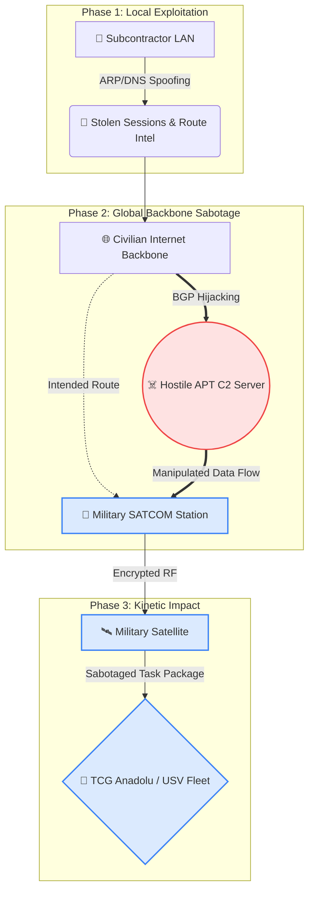
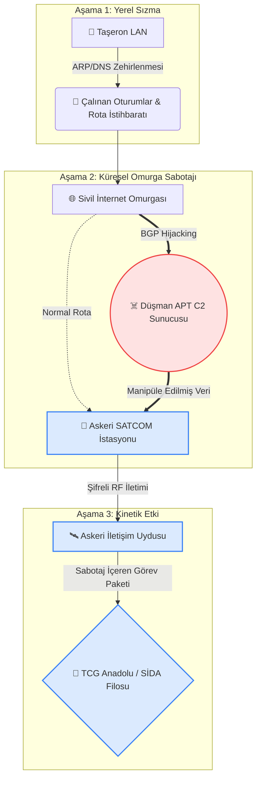

# 🛡️ The New Frontline: Geopolitical Asymmetry and the Weaponization of the Global Internet Backbone

> 🌐 **[🇹🇷 Türkçe versiyonu okumak için buraya tıklayın.](#tr-version)**

In an era where statecraft and silicon are inseparable, the battlefield has shifted from the physical horizon to the routing tables of the global internet. The traditional view of cybersecurity—focused on local breaches and ransomware—is becoming obsolete in the face of sovereign-level threats. When national security assets, such as the **TCG Anadolu** (Amphibious Assault Ship) or autonomous naval fleets, become the target of state-sponsored BGP hijacking and multi-stage Man-in-the-Middle (MITM) operations, "standard compliance" is no longer a defense; it’s a liability. 

This conceptual lab simulation explores the terrifying intersection of regional tensions and advanced cyber-sabotage, mapping out a defensive blueprint for digital survival.

---

## 🇬🇧 Phase I: Threat Landscape & Simulation
**Project:** Simulation of an APT-Driven Hybrid MITM Attack on National Security Assets
**Case Summary: Operation "Blue Blindness"**

* **Target:** The "Naval Task Force Logistics & Coordination Network" responsible for TCG Anadolu, SİHA/SİDA (UAV/USV) fleets, and REİS-class submarines.
* **Geopolitical Context:** Rising conventional tensions in the Eastern Mediterranean. State-sponsored Advanced Persistent Threat (APT) groups initiate an asymmetric cyber operation.

### The Attack Vector (Multi-Stage MITM)
1. **Phase 1 (Localized MITM):** Initial breach via a subcontractor’s LAN using DNS & ARP Spoofing to harvest credentials and map SATCOM pathways.
2. **Phase 2 (Backbone MITM):** Global-scale BGP Hijacking through a compromised Tier-2 ISP to intercept and manipulate tactical data before it reaches satellite uplinks.

### Conceptual Attack Flow
*(The diagram below visualizes how localized breaches escalate into backbone manipulation)*

---

## 🇬🇧 Phase II: Incident Response (IR) Protocol

**1. Detection**
* **LAN Anomalies:** IDS/IPS alerts indicating multiple devices re-routed to a single MAC address (ARP Poisoning).
* **Backbone Anomalies:** USOM (TR-CERT) identifies /24 IP blocks originating from Turkish ground stations being rerouted through a suspicious European ASN.

**2. Classification**
* **Attack Type:** Multi-stage MITM (LAN-to-BGP transition).
* **Severity:** **Red Alert (Combat Readiness State).** A direct threat to naval operational integrity.

**3. Impact Assessment**
* **Intelligence Breach:** Compromise of submarine patrol routes and UAV/USV target coordinates.
* **Sabotage Risk:** Potential manipulation of IFF (Identification Friend or Foe) signals and autonomous fleet telemetry.

**4. IRT Activation**
Command is transferred to the **Cybersecurity Presidency**, **National Intelligence (MIT)**, and **Naval Cyber Defense Command**. Private sector SOC teams are relegated strictly to evidence preservation.

**5. Evidence Collection**
* **Local:** Isolation of PCAP files containing forged DNS responses.
* **Global:** Acquisition of BGP routing table logs and identification of Rogue CAs used for TLS interception.

**6. Containment & Eradication**
* **Stage 1 (Local):** Flushing DNS/ARP caches (`ipconfig /flushdns`, `arp -d`) and mandatory password resets for all subcontractor staff.
* **Stage 2 (Backbone):** Global blackholing of the offending ASN. 
* **Operational Isolation:** Ground stations are fully air-gapped from the public internet. Tactical data is shifted exclusively to **Link-22** networks. New cryptographic key exchanges are initiated for SATCOM.

**7. Reporting & Lessons Learned**
A "Top Secret" intelligence report is submitted to Naval Command, prompting immediate rerouting of active submarine patrols. The vulnerability of "civilian subcontractors" was proven to be a critical failure point. National security cannot rely on standard internet protocols (BGP) without sovereign verification layers.

---

## 🇬🇧 Phase III: The Sovereign Prevention Plan

1. **Strategic BGP Security:** Mandatory **RPKI** (Resource Public Key Infrastructure) implementation for all critical IP blocks. If a foreign actor spoof-announces national IP routes, global routers will drop the route due to cryptographic signature mismatch.
2. **End-to-End National Cryptography:** Abandoning reliance on foreign Certificate Authorities (CAs). Implementing **ASELSAN/TÜBİTAK HSMs** (Hardware Security Modules) for all tactical communication. Naval C2 networks must be physically air-gapped and rely on Out-of-Band (OOB) tunnels via national satellites.
3. **Network Hardening (Standard MITM Defense):** Standardizing **DAI** (Dynamic ARP Inspection) and **DHCP Snooping** across all supply chain partner switches. Mandatory Hardware-Token MFA (e.g., YubiKey) for critical portal access.

 

 

# 🇹🇷 Yeni Cephe: Jeopolitik Asimetri ve Küresel İnternet Omurgasının Silah Haline Getirilmesi

Siyaset ve silikonun birbirinden ayrılamaz hale geldiği bir çağda, savaş alanı fiziksel ufuktan küresel internetin yönlendirme tablolarına kaydı. Siber güvenliğe yönelik geleneksel bakış açısı—yerel ihlallere ve fidye yazılımlarına odaklanan yaklaşım—devlet düzeyindeki tehditler karşısında artık geçerliliğini yitiriyor. **TCG Anadolu** veya otonom deniz filoları gibi ulusal gurur kaynakları, devlet destekli BGP Kaçırma (BGP Hijacking) ve çok aşamalı "Ortadaki Adam" (MITM) operasyonlarının hedefi haline geldiğinde, "standart uyumluluk" artık bir savunma değil; bir zafiyettir. 

Bu laboratuvar simülasyonu, bölgesel gerilimler ile gelişmiş siber sabotajın korkutucu kesişimini inceliyor ve öngörülemeyen bir dünyada dijital hayatta kalma için savunma amaçlı bir yol haritası sunuyor.

---

## 🇹🇷 Kısım I: Tehdit Ortamı ve Simülasyon
**Proje:** Ulusal Güvenlik Unsurlarına Yönelik APT Kaynaklı Karma MITM Saldırısı Simülasyonu
**Vaka Özeti: Operasyon "Mavi Körlük"**

* **Hedef:** TCG Anadolu Amfibi Hücum Gemisi, Silahlı İnsansız Hava ve Deniz Araçları (SİHA & SİDA) filosu ve REİS sınıfı denizaltıların görev öncesi paketlerini koordine eden kıyı tabanlı "Deniz Görev Gücü Lojistik ve Koordinasyon Ağı" ile bu ağa yazılım üreten alt yüklenici firmalar.
* **Jeopolitik Kriz:** Doğu Akdeniz'de gerilimin tırmandığı bir dönemde, devlet destekli Gelişmiş Sürekli Tehdit (APT) grupları tarafından asimetrik bir siber operasyon başlatılmıştır.

### Saldırı Vektörü (İki Aşamalı MITM)
1. **Aşama (Standart Yerel MITM):** Saldırganlar öncelikle SİHA/SİDA otonom kontrol yazılımlarını geliştiren bir alt yüklenici firmanın yerel ağına (LAN) sızarak, DNS ve ARP Zehirlenmesi (spoofing) düzenlemiştir. Oturum bilgileri çalınmış ve Donanma SATCOM (uydu haberleşme) veri yolları haritalanmıştır.
2. **Aşama (İleri Seviye Küresel MITM):** Yerel ağdan elde edilen istihbaratla, saldırganlar Avrupa'daki zafiyetli bir Tier-2 İnternet Servis Sağlayıcısını (ISP) ele geçirmiş ve Türk Deniz Kuvvetleri kıyı veri merkezlerine ait IP blokları için sahte BGP anonsları yapmıştır. TCG Anadolu'ya gönderilecek operasyonel veriler, uyduya çıkmadan önce Avrupa'ya yönlendirilmiş ve manipüle edilmiştir.

### Kavramsal Saldırı Akışı
*(Aşağıdaki şema, yerel bir sızıntının küresel omurga sabotajına nasıl dönüştüğünü göstermektedir)*

---

## 🇹🇷 Kısım II: Olay Müdahale Şeması (Incident Response)

**1. Olay Tespiti (Detection)**
* **Yerel Ağ Anomalileri:** IDS/IPS sistemleri tarafından, birden fazla cihazın tek bir MAC adresine yönlendirildiğini gösteren ARP Zehirlenmesi alarmları.
* **Küresel Rota Anomalileri:** USOM ve omurga güvenlik sistemlerinde, Kıyı-Gemi iletişimini sağlayan yer istasyonlarına ait /24 IP bloklarının Avrupa merkezli şüpheli bir ASN üzerinden geçmeye başladığının tespiti.

**2. Olayın Sınıflandırılması**
* **Saldırı Vektörü:** Çok katmanlı ortadaki adam (MITM) saldırısı.
* **Önem Seviyesi:** **Kırmızı İkaz (Muharebe Alarmı Durumu).** Ulusal güvenlik sabotajı.

**3. Etki Değerlendirmesi**
* **Kritik İstihbarat İhlali:** Denizaltı devriye sahalarının ve İHA/SİHA hedef koordinatlarının dinlendiği kesinleşmiştir.
* **Operasyonel Sabotaj Riski:** Dost/Düşman Tanıma (IFF) sinyallerinin manipüle edilip edilmediği (veri bütünlüğü bozulması) acilen doğrulanmalıdır.

**4. Olay Müdahale Ekibinin (IRT) Etkinleştirilmesi**
Komuta; Siber Güvenlik Başkanlığı, MİT Siber İstihbarat Daire Başkanlığı ve Deniz Kuvvetleri Siber Savunma Komutanlığı'na devredilmiştir. Firma SOC ekipleri yalnızca kanıt toplama için emre tâbi olmuştur.

**5. Kanıt Toplama**
* **Yerel:** Sahte DNS yönlendirmelerini içeren PCAP dosyalarının izolasyonu.
* **Küresel:** BGP yönlendirme tablosu geçmişi ve saldırganların kullandığı sahte kriptografik Kök Sertifikaların (Rogue CA) tespiti.

**6. Sınırlandırma ve Yok Etme**
* **Aşama 1 (Yerel):** DNS ve ARP önbelleklerinin temizlenmesi (`ipconfig /flushdns`, `arp -d`). Personel şifrelerinin zorunlu sıfırlanması.
* **Aşama 2 (Küresel):** Yurt dışı ASN derhal kara listeye (blackholing) alınmıştır.
* **Operasyonel İzolasyon:** Kıyı yer istasyonları internetten tamamen koparılmış (air-gapped) ve iletişim TSK Özel Taktik Veri Ağları (Link-22) üzerine kaydırılmıştır.

**7. Raporlama ve Ders Çıkarma**
Deniz Kuvvetleri Komutanlığı Harekat Merkezi'ne sunulan "Çok Gizli" raporla devriye rotaları acilen değiştirilmiştir. İzole savaş gemilerine veri sağlayan sivil alt yüklenicilerin, BGP protokolü üzerinden devasa bir siber zafiyet noktası olduğu hayati bir tecrübeyle kanıtlanmıştır.

---

## 🇹🇷 Kısım III: Egemenlikçi Eylem Planı (Sovereign Prevention Plan)

1. **BGP Yönlendirme Güvenliği (Stratejik MITM Koruması):** Askeri ve kritik altyapı IP blokları için Kaynaklı Açık Anahtar Altyapısı (**RPKI**) zorunlu hale getirilecektir. Yabancı bir anons, imza uyuşmazlığı nedeniyle küresel yönlendiriciler tarafından reddedilecektir.
2. **Uçtan Uca Ulusal Kriptografi ve İzolasyon:** Yabancı Sertifika Otoritelerine (CA) olan güven terk edilecektir. Tüm veri akışı ASELSAN/TÜBİTAK üretimi Ulusal Donanımsal Şifreleme Modülleri (**HSM**) üzerinden şifrelenecek ve Bant Dışı (OOB) izole tüneller kullanılacaktır.
3. **Yerel Ağ Sıkılaştırması (Standart MITM Koruması):** Taşeron ağlarında Dinamik ARP Denetimi (**DAI**) ve **DHCP Gözetleme** zorunlu kılınacaktır. Kritik erişimler için donanımsal belirteç (Örn: YubiKey) tabanlı **MFA** standartlaştırılacaktır.

---

### 📚 References & Technical Resources / Kaynakça

* **Cisco Systems:** *LAN Security Best Practices: DHCP Snooping and Dynamic ARP Inspection (DAI).*
* **Cloudflare Learning Center:** *What is BGP Hijacking? | BGP Routing Security.*
* **Cumhurbaşkanlığı Dijital Dönüşüm Ofisi (CBDDO):** *Bilgi ve İletişim Güvenliği Rehberi.*
* **MANRS (Mutually Agreed Norms for Routing Security):** *MANRS Implementation Guide for Network Operators.*
* **MITRE ATT&CK Framework:** *Adversary-in-the-Middle (T1557) and Route Misdirection (T1659).*
* **NATO Cooperative Cyber Defence Centre of Excellence (CCDCOE):** *Maritime Cybersecurity Analysis.*
* **TÜBİTAK BİLGEM:** *Ulusal Kriptoloji Enstitüsü: Donanımsal Güvenlik Modülleri (HSM) ve Kriptografik Sistemler.*
* **Ulusal Siber Olaylara Müdahale Merkezi (USOM):** *Siber Tehdit Bildirimleri ve Olay Müdahale Kılavuzları.*
