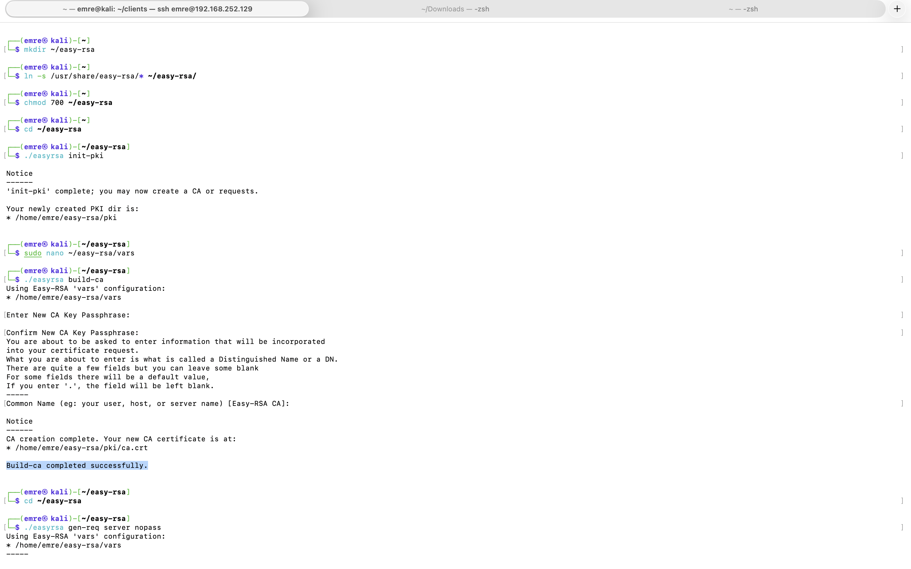
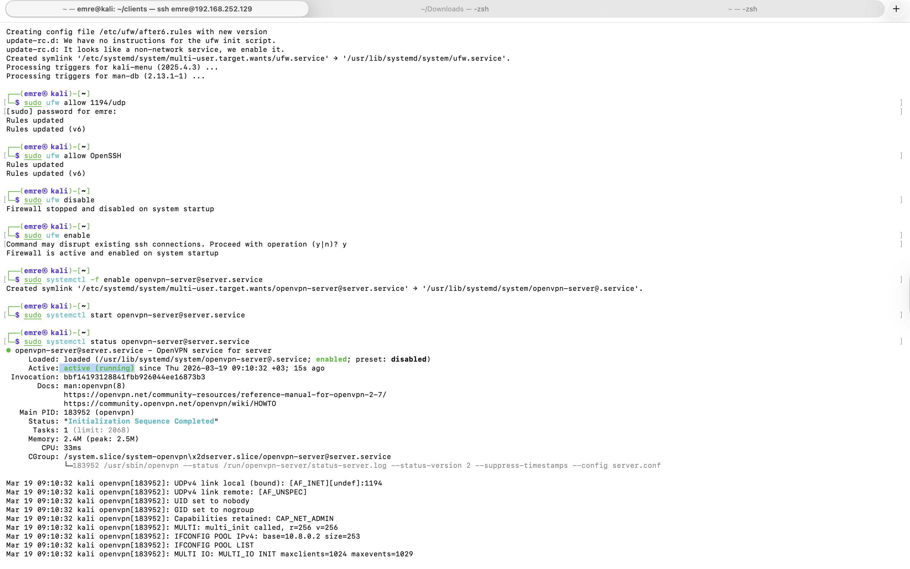
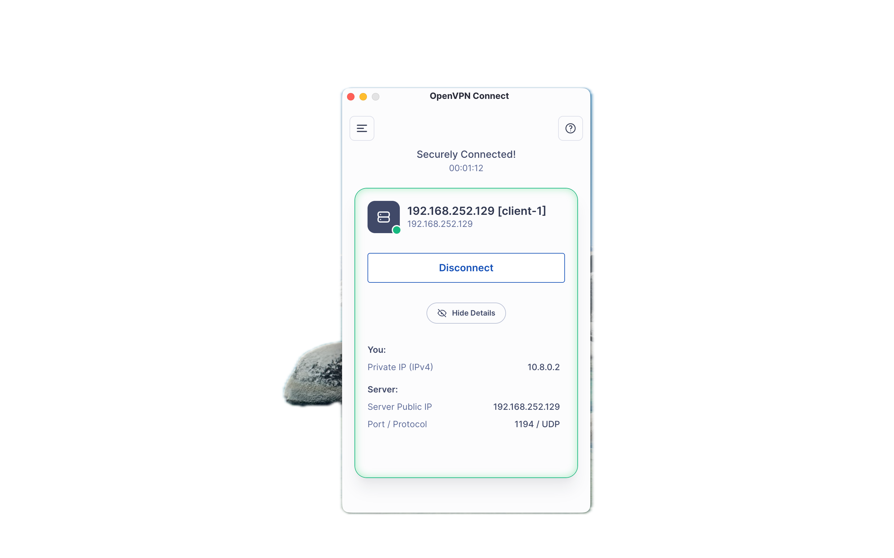
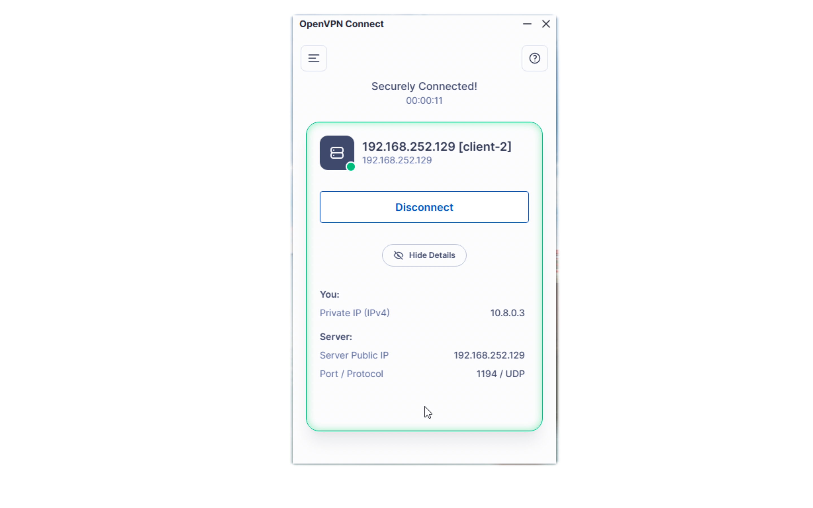

[🇹🇷 Türkçe versiyon için tıklayın (Click here for Turkish version)](#turkce-versiyon)

---

# 🇬🇧 Cross-Platform Secure Network Tunnel Setup with OpenVPN Server

## Introduction
Setting up a Virtual Private Network (VPN) is one of the most fundamental skills in cybersecurity. In this lab work, the necessary cryptographic infrastructure was built from scratch and a secure VPN was created. Using a Kali Linux virtual machine as the server, and MacOS (physical) and Windows 11 (virtual) machines as clients, a cross-platform supported OpenVPN gateway was configured. This guide includes the steps of establishing a Public Key Infrastructure (PKI), hardening server settings, routing network traffic, and most importantly, solving real-world problems encountered during this process.

### Phase 1: Establishing Public Key Infrastructure (PKI) and Certificate Authority (CA)
To set up the personal Certificate Authority (CA), the `easy-rsa` tool was first installed. A custom directory was created and the PKI infrastructure was initialized, defining the cryptographic security structure:

```bash
make-cadir ~/easy-rsa
cd ~/easy-rsa
./easyrsa init-pki
./easyrsa build-ca
```


*Screenshot 1: Completion of the Certificate Authority (CA) configuration*

### Phase 2: Generating Keys and Server Hardening
Certificate signing requests (CSR) and private keys were generated for the OpenVPN server and clients, and these were signed by our personal CA. To set up an additional defense layer against Denial of Service (DoS) attacks, a TLS-Crypt key (`ta.key`) was generated:

```bash
./easyrsa gen-req server nopass
./easyrsa sign-req server server
openvpn --genkey secret ta.key
```

Then, the following hardening steps were applied in the `server.conf` file:
* Updating the encryption algorithm to `AES-256-GCM`
* Using `SHA256` for message authentication
* Disabling Diffie-Hellman parameters (`dh none`) since Elliptic Curve Cryptography (ECC) is used
* Dropping system privileges after the service starts: `user nobody`, `group nogroup`
* Routing all traffic to the tunnel with the `redirect-gateway def1` command

### Phase 3: Network Routing and Client Connection
IP forwarding (`net.ipv4.ip_forward`) was enabled to turn the Kali Linux virtual server into a router. Then, by writing Network Address Translation (NAT) rules over the Uncomplicated Firewall (UFW), the VPN traffic (`10.8.0.0/8`) was routed out, and the UDP 1194 port was opened:

```bash
sudo ufw allow 1194/udp
sudo ufw allow OpenSSH
sudo ufw enable
sudo systemctl start openvpn-server@server.service
```


*Screenshot 2: Enabling the Uncomplicated Firewall (UFW) and traffic routing*

Instead of manually moving certificate packages across different environments to the OpenVPN application, a Bash script (`make_config.sh`) was written, combining all packages into a single `.ovpn` profile. Files were securely transferred using `scp` on the MacOS device and the `WinSCP` tool in the Windows environment, successfully establishing the tunnel connections.


*Screenshot 3: Establishment of the VPN tunnel connection for the MacOS physical device user*


*Screenshot 4: Establishment of the VPN tunnel connection for the Windows 11 virtual environment user*

## Troubleshooting & Lessons Learned
A laboratory environment is rarely flawless. During this setup, several architectural and system-level obstacles requiring analytical troubleshooting skills were encountered:

* **Missing Firewall Tools:** Since Kali Linux does not natively include UFW, a "command not found" error was received while writing rules. The missing tool was manually added to the system using the `sudo apt install ufw` command.
* **Cloud Synchronization Chaos (iCloud/OneDrive):** While importing `.ovpn` profiles on the MacOS physical device and the Windows 11 virtual environment, the OpenVPN application threw an "Unsupported file" error. It was understood that the root cause was the cloud-synced (iCloud/OneDrive) files being moved to the web drive, leaving behind invalid `.icloud` formatted shortcuts and opening a OneDrive file path. As a solution, local folders isolated from the cloud ecosystem (e.g., `C:\VPN_Lab`) were created, and the issue was resolved by moving the files there.
* **Virtual Network Isolation and File Transfer Errors:** When attempting to install WinSCP inside the Windows VM, the drag-and-drop feature did not work due to a lack of VM extensions. As a solution, an offensive security tactic was employed, and a built-in Python web server (`python3 -m http.server 8000`) was spun up on MacOS. This allowed the installation file to be served to the Windows 11 virtual environment over the local network.
* **Missing TLS-Crypt Keys:** During the first VPN tunnel connection attempt, a "ta.key cannot open for read" error was received. It was understood that the root cause was the template configured for the extra security layer looking for a physical `ta.key` file right next to the `.ovpn` profile. The solution was identified as using the WinSCP tool to infiltrate the Kali Linux server via Secure File Transfer Protocol (SFTP), retrieving the missing key, and adding it next to the `.ovpn` profile.

## Conclusion
This hands-on lab provided a deep and analytical perspective on how enterprise VPN architectures operate in the background, not only by configuring the cryptographic infrastructure (PKI) and Network Address Translation (NAT) rules with ready-made instructions but also by practicing overcoming complex structural obstacles at the operating system level.

---

## <a id="turkce-versiyon"></a>🇹🇷 Türkçe Versiyon: OpenVPN Sunucusuyla Çapraz Ortamda Güvenli Ağ Tüneli Kurulumu

## Giriş
Sanal Özel Ağ (VPN) kurmak, siber güvenliğin en temel yeteneklerinden biridir. Bu laboratuvar çalışmasında gerekli kriptografik altyapı sıfırdan kurulmuş ve güvenli bir VPN oluşturulmuştur. Kali Linux sanal makinesini sunucu, MacOS (fiziksel) ve Windows 11 (sanal) makinelerini ise istemci (client) olarak kullanarak çapraz ortam (cross-platform) destekli bir OpenVPN ağ geçidi yapılandırılmıştır. Bu rehber, Açık Anahtar Altyapısı (PKI) kurma, sunucu ayarlarını sıkılaştırma (hardening), ağ trafiğini yönlendirme ve en önemlisi bu süreçte karşılaşılan gerçek hayat sorunlarını çözme adımlarını içermektedir.

### 1. Aşama: Açık Anahtar Altyapısı (PKI) ve Sertifika Merkezinin (CA) Kurulması
Kişisel Sertifika Merkezi’ni (CA) kurmak için önce `easy-rsa` aracı yüklenmiştir. Özel bir dizin oluşturulmuş ve PKI altyapısı başlatılarak, kriptografik güvenlik yapısı tanımlanmıştır:
	
```bash
make-cadir ~/easy-rsa
cd ~/easy-rsa
./easyrsa init-pki
./easyrsa build-ca
```


*Ekran Görüntüsü 1: Sertifika Merkezi (CA) yapılandırmasının tamamlanması*

### 2. Aşama: Anahtarların (Key) Üretilmesi ve Sunucunun Sıkılaştırılması (Hardening)
OpenVPN sunucusu ve istemciler için sertifika imzalama talepleri (CSR) ve özel anahtarlar oluşturulmuş ve bunlar kişisel CA'mıza imzalatılmıştır. Hizmet reddi (DoS) saldırılarına karşı ayrıca bir savunma katmanı kurmak için bir TLS-Crypt anahtarı (`ta.key`) üretilmiştir:

```bash
./easyrsa gen-req server nopass
./easyrsa sign-req server server
openvpn --genkey secret ta.key
```

Ardından `server.conf` dosyasında şu sıkılaştırmalar (hardening) yapılmıştır:
* Şifreleme algoritmasının `AES-256-GCM` ile güncellenmesi
* Mesaj doğrulama için `SHA256` kullanımı
* Eliptik Eğri Şifrelemesi (ECC) kullanıldığı için Diffie-Hellman ara ölçütlerinin kapatılması: `dh none`
* Servis başlatıldıktan sonra sistem yetkilerinin düşürülmesi: `user nobody`, `group nogroup`
* `redirect-gateway def1` komutuyla tüm trafiğin tünele yönlendirilmesi

### 3. Aşama: Ağ Yönlendirmesi ve İstemci Bağlantısı
Kali Linux sanal sunucusunu bir yönlendiriciye (router) çevirmek için IP yönlendirmesi (`net.ipv4.ip_forward`) etkinleştirilmiştir. Ardından Varsayılan Güvenlik Duvarı (UWF) üzerinden Ağ Adres Çevirisi (NAT) kuralları yazılarak, VPN trafiği (`10.8.0.0/8`) dışarı aktarılmış ve UDP 1194 bacağı/portu açılmıştır:

```bash
sudo ufw allow 1194/udp
sudo ufw allow OpenSSH
sudo ufw enable
sudo systemctl start openvpn-server@server.service
```


*Ekran Görüntüsü 2: Varsayılan Güvenlik Duvarı (UWF) etkinleştirilmesi ve trafik yönlendirmesi*

Farklı ortamlardaki sertifika paketlerini OpenVPN uygulamasına manuel taşımak yerine, bir Bash betiği (`make_config.sh`) yazılarak, tüm paketler tek bir `.ovpn` profilinde birleştirilmiştir. Dosyalar MacOS aygıtında `scp`; Windows ortamında ise `WinSCP` aracıyla güvenli bir şekilde aktarılmış ve tünel bağlantıları başarıyla kurulmuştur.


*Ekran Görüntüsü 3: MacOS fiziksel aygıt kullanıcısının VPN tünel bağlantısının kurulması*


*Ekran Görüntüsü 4: Windows 11 sanal ortam kullanıcısının VPN tünel bağlantısının kurulması*

## Sorun Giderme ve Çıkarılan Dersler (Troubleshooting)
Bir laboratuvar ortamı nadiren kusursuzdur. Bu kurulum sırasında, analitik sorun giderme becerileri gerektiren çeşitli mimari ve sistem düzeyinde engellerle karşılaşılmıştır:

* **Eksik Güvenlik Duvarı Araçları:** Kali Linux yerleşik olarak UFW barındırmadığından, kuralları yazarken "komut bulunamadı" hatası alınmıştır. Eksik araç, `sudo apt install ufw` komutuyla manuel olarak sisteme dahil edilmiştir.
* **Bulut Eşzamanlaması Karmaşası (iCloud/OneDrive):** `.ovpn` profillerini MacOS fiziksel aygıtında ve Windows 11 sanal ortamında içe aktarırken OpenVPN uygulaması "Desteklenmeyen dosya" hatası vermiştir. Kök nedenin bulutta eşzamanlanan (iCloud/OneDrive) dosyaların web sürücüsüne taşınmasıyla geride geçersiz `.icloud` biçimli kısayollar bırakması ve OneDrive dosya yolu açması olduğu anlaşılmıştır. Çözüm olarak, bulut ekosisteminden izole edilmiş yerel klasörler (örn. `C:\VPN_Lab`) oluşturulmuş ve dosyaların buralara taşınmasıyla sorun aşılmıştır.
* **Sanal Ağ İzolasyonu ve Dosya Aktarım Hataları:** Windows VM içine WinSCP kurulmak istendiğinde sürükle-bırak özelliği VM eklentileri eksikliği nedeniyle çalışmamıştır. Çözüm olarak ofansif bir güvenlik taktiğine başvurulmuş ve MacOS üzerinde yerleşik bir Python web sunucusu (`python3 -m http.server 8000`) canlandırılmıştır. Bu sayede kurulum dosyası yerel ağ üzerinden Windows 11 sanal ortamına sunulmuştur.
* **Eksik TLS-Crypt Anahtarları:** İlk VPN tünel bağlantı denemesinde “ta.key okunamadı” hatası alınmıştır. Kök nedenin, ekstra güvenlik katmanı için yapılandırılan şablonun `.ovpn` profilinin hemen yanında fiziksel bir `ta.key` dosyası araması olduğu anlaşılmıştır. Çözümün, WinSCP aracıyla Kali Linux sunucusuna Güvenli Dosya Aktarımı Protokolü (SFTP) üzerinden sızılarak eksik anahtarın çekilmesi ve `.ovpn` profilinin yanına eklenmesi olduğu anlaşılmıştır.

## Sonuç
Bu çalışma salt hazır talimatlarla kriptografik altyapıyı (PKI), Ağ Adresi Çevirmesi (NAT) kurallarını yapılandırmayı değil, aynı zamanda işletim sistemi düzeyindeki karmaşık yapısal engelleri aşmayı pratik ederek, kurumsal VPN mimarilerinin arka planda nasıl işlediğine dair derinlikli ve analitik bir bakış açısı kazandırmıştır.
